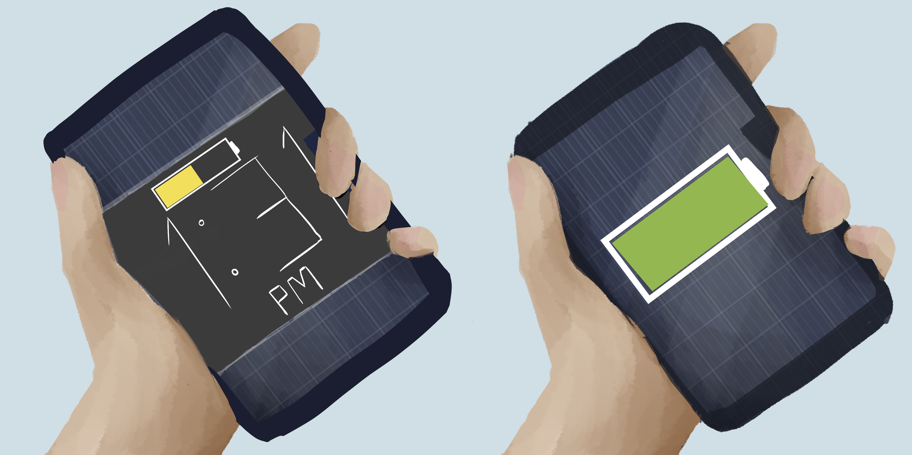

# **Solar Phone Case**

I chose to create the solar panel phone case after researching about solar panels and Teslas solar shingles. The idea was to start getting more people accustomed to clean energy by starting off with something small --like a phone. Everyone uses a phone and we all know how stressed we can get if we forget our charger and our phone is about to die. So instead of stressing, all you would have to do is hold you phone in direct sunlight and it would charge. I chose to document my work like this in order to display the two different design ideas for the solar phone: think of it as a blueprint.

- Date: May ,8 2019
- Medium: Digitally painted images via photoshop [6.5in by 13in]
- Title: Solar Phone Cases [two different designs of the cases]
- Description: The picture shows two different designs of the solar phone cases. The one on the left displaying less solar panels in the case with a see through middle displaying time and battery percentage. The less amount of surface area for the solar panels does mean it charges slower than the one on the right, but there is less risk of getting finger print smudges on them. On the right is a phone case with the entire surface area -excluding the small square near the fingers- is covered with solar panels. This design charges much faster due to the greater surface area. However, it is more prone to fingerprint smudges.
