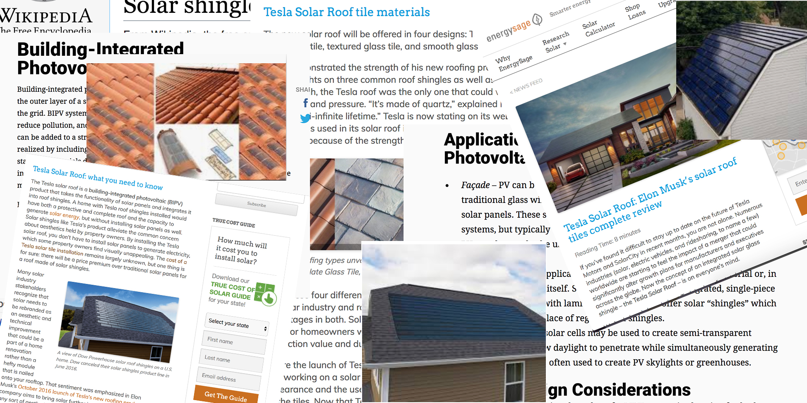

`*Why did you choose to document your research in this way?*`

The reason I chose to document my work in this way was that I had no other way of visualizing my research. In the city, it's near impossible to find buildings with solar panels, let alone the specific solar panel roofing tiles such as the ones I'm researching. So instead I took screen shots of websites, pictures, and whatnot tied to what I looked up in order to produce the current information I've gathered.

Research

Date: April 3, 2019
Description: Screenshots of pictures and website/research material on the solar panels.
